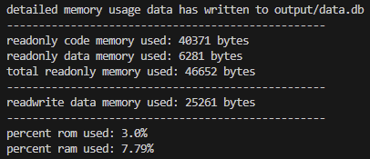
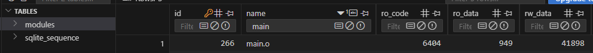

# Linker Map Analyzer
A simple tool to analyze .map files created by the IAR Embedded Workbench linker.

## Current Features:
- export rom/ram of the compiled code segments into a SQLite database for easy inspection
- output rom/ram usage summary (absolute and %)
- easily add new device configurations
- configuration of default parameters via coonfig.ini
- supports .map files created by the IAR Embedded Workbench linker
  - .map files created by other linkers will most likely not work 

## Configuring default parameters
Default Parameters can be configured via config.ini
- Device: Default device config to load if none is provided via the '-device' parameter
- InputFolder, MapName: Default path to the .map file if none is provided via the '-map' parameter
- OutputFolder, DBName: Path where the output database will be created

## Running the map analyzer:
- command line arguments:
  - -map: path to .map file (optional)
    - if none is provided: use path defined in config.ini (default: input/firmware.map)
  - -device: device config to read from devices.json, optional
    - - if none is provided: use device defined in config.ini (default: None)
- usage examples: 
  - mapAnalyzer.py -device STM32F413VG
  - mapAnalyzer.py -map "C:\project\iar\output\fimware.map" 
  - mapAnalyzer.py -map fw.map -device STM32F413VG

## Configuring a new device
In order to calculate the relative rom/ram usage of an application the available rom/ram of the target device needs to be known.\
This data will be provided by the devices.json config file.\
Ram and rom values have to be provided in kB.

New entries can either be created manually or by using addDevice.py:
- addDevice.py [device name] [rom] [ram]
- usage example: 
  - addDevice.py STM32F412CE 1024 256

